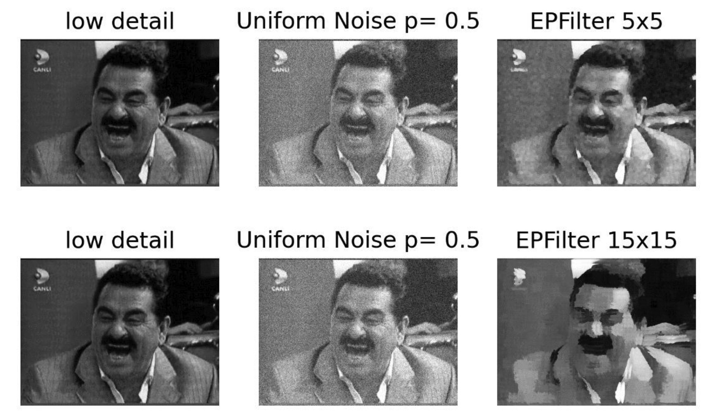
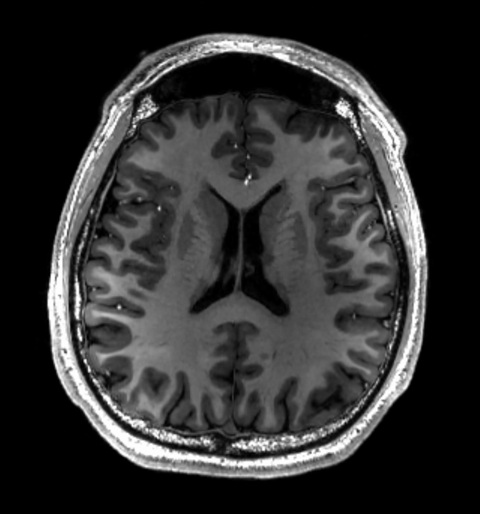
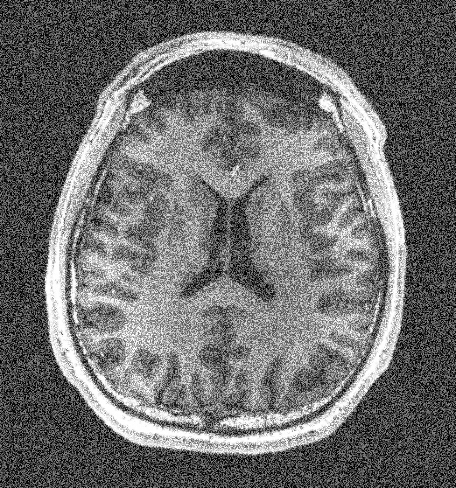
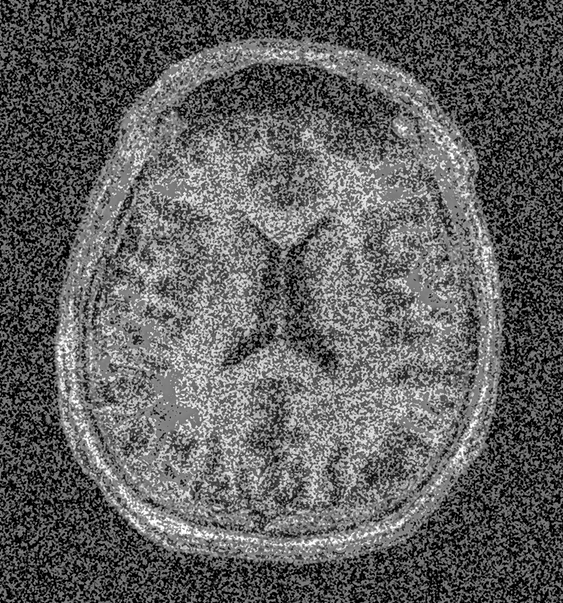
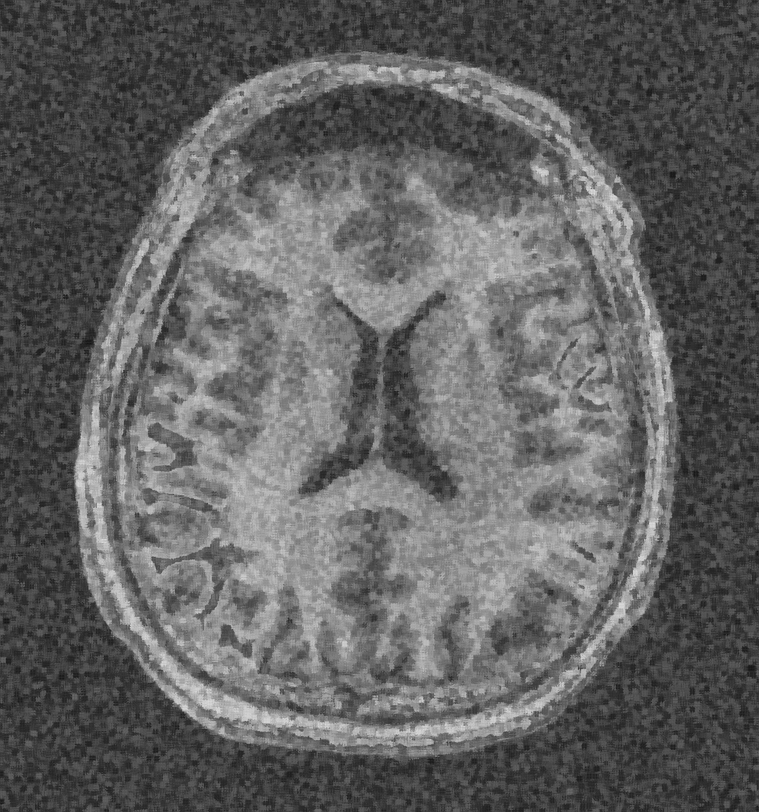

# Image Processing Projects
This repository contains projects related to image processing. The projects are implemented in Python using OpenCV and other libraries.

## Homework 1: Edge Preserving Filters

Edge-preserving  smoothing  or  filtering  is  an  image  processing  technique  that  smooths  away  noise  or textures  while  retaining  sharp  edges.  
Examples  are  the  **median,  bilateral,  guided,  anisotropic  diffusion, and Kuwahara filters**. For more information, please refer to the [file](./HW1/CMP717_HW1.pdf).

<table border="0">
    <tr>
    <td>
Original Image
</td>
    <td>
Gaussian Noisy Image
</td>
    <td>
Median Blur
</td>
    <td>
Kuwahara Blur
</td>
  </tr>
  <tr>
    <td></td>
    <td></td>
    <td></td>
    <td></td>
  </tr>
</table>
